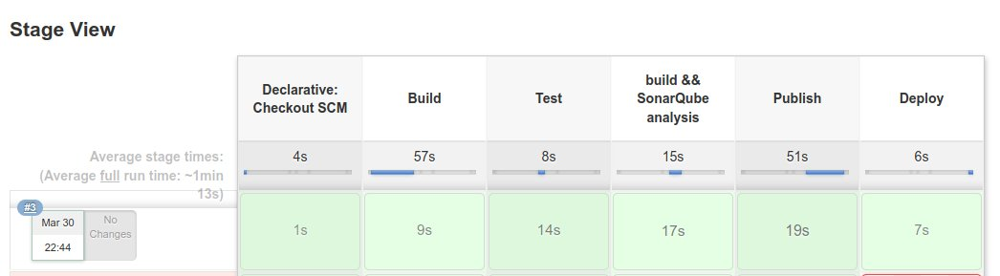

# End-to-End-DevOps
----
## Purpose of the project

With this project I am trying to create a immutable infrastructure with simple deployment pipeline. I hope that project will help you to understand basics and integrations of tools that used for CI/CD pipelines. 

For now project only includes technologies like Kubernetes, Ansible, Vagrant and Jenkins but in near future additional tools will be added and playbooks will be similar to best practices with some test cases.

## Technologies

- Ansible
- Vagrant 
- Jenkins
   - Configuration As Code
   - Pipeline
- SonarQube
   - Sonar-Scanner
- PostgreSQL
- Kubernetes
   - Flannel
- Docker
- Golang

## What happens after startup

After provisioning servers, Ansible uses common role for updating packages, changing DNS settings, disabling swap etc.

SonarQube will be installed with PostgreSQL and Sonar-Scanner. 

Jenkins role is installing Jenkins with some plugins and add admin user. Then uses Configuration As Code plugin to create jobs and credentials.

Docker and Kubernetes roles are basically install required packages and start Kubernetes Cluster with Flannel. 

After triggering job with commiting GitHub repository, app inside src directory is building and testing. After test pass, SonarQube scans code, Dockerfile is creating the image and push it to the private repository inside DockerHub. Then publish app inside Kubernetes cluster with the help of Ansible playbooks.

----
## Requirements 
- Virtualbox
- Vagrant
- Ansible
- Github account
- Dockerhub account

----
## Usage
### Fork repository

For testing everything I recommend to use private repository. As you can see, repository stores credentials(for now). This can cause serious security problems.

Also creating private Dockerhub repository is recommended.

### Change variables

Change variables at group_vars/all. Don't forget github and dockerhub.

    github_repo: end-to-end-devops
    github_username: ######
    github_password: ######

    dockerhub_repo: end-to-end-devops
    dockerhub_username: #####
    dockerhub_password: #####
    dockerhub_email: #####

Change variables at hosts. Make sure that you configured your ssh keys. Check your ssh keys with;

    vagrant ssh-config

to see where is your ssh keys that you created.

### Provisioning

    cd ~
    vagrant up

### Show time

Use ansible-playbook for installing Jenkins, Docker and Kubernetes.

    ansible-playbook -i hosts scratch.yml

### Testing pipeline

Just commit to your project and Jenkins job will be triggered. After finishing job check your application on your host.

    curl 192.168.7.2:32000

### Better, Faster, Stronger!

Actually I don't download, build and install all of the things. Everything as Code projects like that are taking too much time to build. For example common and docker roles are used in all virtual machines. I created a box with that roles so I don't always update packages and install new ones. You can use snapshots for development too. 

Everything depends on your commit. If you change little pieces of all roles, then you need to build project from scrath. If you change a little line of code in Configuration-as-Code plugin, just reload file and don't waste your time with building. 

You can also use cloud providers for better internet connection but make sure that you configured a fine firewall and other security stuff. 

## About Firewalld and SELinux

As you can see I don't use firewall for this project. You can enable firewalld and ports, I added them inside project but for testing environment, I don't want to use them.

## TODO

- Add monitoring tool with alert system
- Molecule for testing playbook
<<<<<<< HEAD
- Write Turkish blog post about project
=======
- Write Turkish blog post about project
- Add comments for every step of the project
>>>>>>> f70758d2e50ca3e5c0a9887bb2a09ddad25cf029
